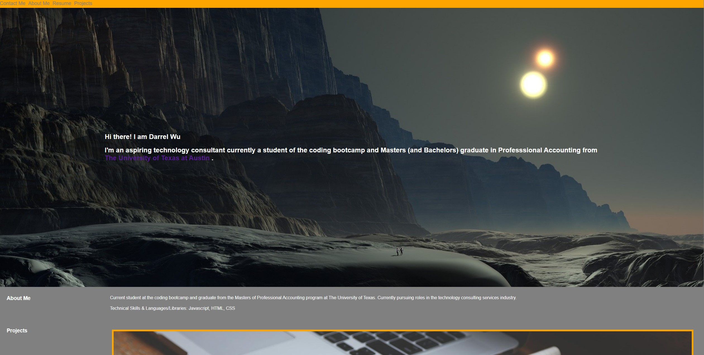
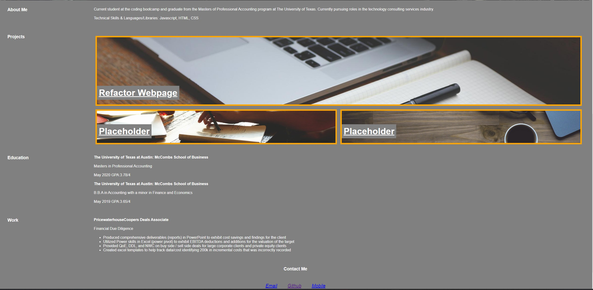

# Darrel Wu Portfolio
 
## Personal Portfolio Webpage
 
My motivation today is to alter the codebase so that it follows accessibility standards so that the website is optimized for search engines. In order to accomplish this goal the following problems must have been solved:
 
 
* The portfolio page must highlight projects 
* The portfolio page must include developers name, photo/avatar 
* The portfolio page must link to navigation bar with “about developer”, “projects”, and “contact information”
* The portfolio base code must have comments in HTML and CSS with the structure to flow logically
* The portfolio page must ensure functionality
* The portfolio page first picture must be larger than the others
* The portfolio images are deployed to the applications
* The portfolio adapts to different viewports

## Usage
This is to demonstrate my own personal portfolio website that will be used to show recruiters and others on the different projects I have participated in. 
 
## Demo
 

 

 
## License
 
MIT License
 
Copyright (c) [2022] [Darrelwu]
Permission is hereby granted, free of charge, to any person obtaining a copy of this software and associated documentation files (the "Software"), to deal in the Software without restriction, including without limitation the rights to use, copy, modify, merge, publish, distribute, sublicense, and/or sell copies of the Software, and to permit persons to whom the Software is furnished to do so, subject to the following conditions:
The above copyright notice and this permission notice shall be included in all copies or substantial portions of the Software.
THE SOFTWARE IS PROVIDED "AS IS", WITHOUT WARRANTY OF ANY KIND, EXPRESS OR IMPLIED, INCLUDING BUT NOT LIMITED TO THE WARRANTIES OF MERCHANTABILITY, FITNESS FOR A PARTICULAR PURPOSE AND NONINFRINGEMENT. IN NO EVENT SHALL THE AUTHORS OR COPYRIGHT HOLDERS BE LIABLE FOR ANY CLAIM, DAMAGES OR OTHER LIABILITY, WHETHER IN AN ACTION OF CONTRACT, TORT OR OTHERWISE, ARISING FROM, OUT OF OR IN CONNECTION WITH THE SOFTWARE OR THE USE OR OTHER DEALINGS IN THE SOFTWARE.
